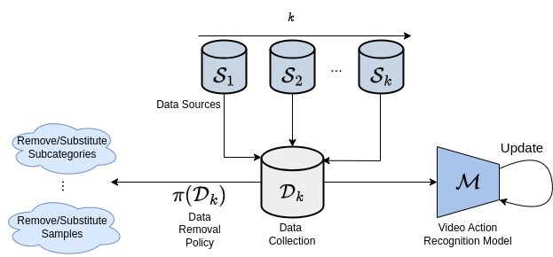

# Incremental and Decremental Continual Learning for Privacy-preserving Video Recognition (TWYN@ECCV2024)


This repository contains the code to reproduce the experimental results for the paper *Incremental and Decremental Continual Learning for Privacy-preserving Video Recognition*, presented at the **Trust What You LearN workshop (ECCV 2024)**. 
The link to the paper will be available soon. 

# Setting up the environment

To run the code you must create an Anaconda environment from the `environment.yml` file and activate it:

```
conda env create -n data_incdec -f environment.yml 
conda activate data_incdec
```

# Setting up the dataset

## Download Kinetics
We suggest to download the Kinetics 700-2020 dataset from torchvision: https://pytorch.org/vision/main/generated/torchvision.datasets.Kinetics.html?highlight=kinetics. 

This is because Kinetics, being a dataset of videos from Youtube, may see the removal of many videos included in the dataset. As such, the download from Pytorch should guarantee the conservation of old videos.

We included the original scripts into the *kinetics_download* folder.

To start the download, simply execute the bash *k700_200_downloader.sh*. After it is finished, execute the extractor bash *k700_2020_extractor.sh*. Note that they are modified to download only the train directory of the original Kinetics, since all the videos we use are from that split.

## Set up video folder structure and frames extraction

After both the download and extraction is finished, we have to select the videos we want to work with and extract the frames in a particular video folder structure. To do so, you have to execute the *Kinetics/create_kinetics_folder.py* with the following format:
```
python data_incdec_framework/Kinetics/create_kinetics_folder.py path_to_original_kinetics_videos Kinetics/
```
where *path_to_original_kinetics_videos* is the path where you downloaded and extracted the videos (if you just run the bash scripts as specified without changing, it should be *kinetics_download*).

After doing so, inside *Kinetics/Videos* there should be folders with inside the extracted frames and also a category.csv file, for each folder.
Note that since 3 videos from the original Kinetics 700 2020 are missing from the downloader, we already included them inside of the *Kinetics/Videos* folder.

## Subcategories csv

The **subcategories_to_remove.csv** and **subcategories_to_substitute.csv** are required to run the Decremental and Incremental/Decremental pipelines. I suggest to put them in the folder *Kinetics/Info* with all of the other csv files, but since we can specify where to find them, it is not required. The exact same copy of the two files to replicate the experiments is already provided in the Kinetics/Info folder as examples, but we will discuss them to provide context of their usage.

### Decremental: subcategories_to_remove.csv

In this file we will say how the subcategories from each of the classes need to be removed.

The first row of the csv needs to have the label of the classes that are used in the dataset (for our case, *smoking*, *phone*, *fatigue*, *food* and *selfcare*).

On the second row, if we don't want to remove any subcategories on the task 0, we just have to put 0 on all of the columns(classes).

After this, an extra row needs to be created for each of the incremental tasks we want to perform. The values we add to each column will say how many subcategories we want to remove from each of the classes.

To replicate our experiments, it should be:

```
smoking,phone,fatigue,food,selfcare
0,0,0,0,0
0,0,2,3,3
0,0,0,3,3
0,0,0,3,3
0,0,0,2,0
2,2,2,2,2
```


### Incremental/decremental: subcategories_to_substitute.csv

In this file we will say how the subcategories from each of the classes need to be substituted at each task.

The first row of the csv needs to have the label of the classes that are used in the dataset (for our case, *smokng*, *phone*, *fatigue*, *food* and *selfcare*).

On the second row we need to specify how many subcategories we want for each of the classes on the first task. If we want to substitute them on the following tasks, it needs to be a subset of the total subcategories for each class..

After this, an extra row needs to be created for each of the incremental tasks we want to perform. The values we add to each column will say how many subcategories we want to substitute from each of the classes.

An example with 5 incremental tasks after the first one will be:

To replicate our experiments, it should be:

```
smoking,phone,fatigue,food,selfcare
2,2,3,7,6
0,0,0,2,2
0,0,0,2,1
0,0,0,1,1
0,0,1,1,1
1,1,1,1,1
```

# Running the code for Data Incremental/Decremental pipelines 

To run the code you can use the command line interface with a prompt like the one:

```
python -u ./data_incdec_framework/cl_framework/main.py \
    -op 'output_path' \
    --approach incdec --pipeline baseline --n_accumulation 4 --seed $i --nw 4 \
    --freeze_bn no --freeze_backbone no --early_stopping_val 10 --weight_decay 5e-4 \
    --ewc_lambda 500 \
    --stop_first_task no \
    --epochs 100 --batch_size 4 --lr_first_task 1e-4 --lr_first_task_head 1e-4 --head_lr 1e-4 --backbone_lr 1e-4 \
    --scheduler_type fixd --plateau_check map --patience 10 --device 0 \
    --criterion_type multilabel --dataset kinetics --data_path ./Kinetics \
    --subcategories_csv_path None --subcategories_randomize yes \
    --n_task 6 --sampler imbalanced \
    --backbone movinetA0 --pretrained_path ./cleaned_checkpoint_sgd.pt
```

All the hyperparameters for running the experiments are explained briefly in the next section. Also, we will provide an exact example of the hyperparameters to replicate each of the experiments, in `experiments.sh`.

# Command-line arguments
* `-op`: folder path where results are stored.
* `--approach`: Type of machine learning approach to be followed. Choices are: ["incdec", 'incdec_lwf', 'incdec_fd', 'incdec_ewc']. (default=incdec)
* `--pipeline`: Type of pipeline to be followed in the incdec type approaches. ["baseline","decremental","incremental_decremental","joint_incremental"]. (default=baseline)
* `--n_accumulation`: To be used in case you want to do gradient accumulation. If 0, no gradient accumulation will be used, else it will accumulate for n batches. (default=0)
* `--seed`: Seed to be initialized to (default=0)
* `--nw`: num workers for data loader (default=4)
* `--freeze_bn`: If training need to be done with the batch norm frozen. Choices: ['yes','no']. (default=no)
* `--freeze_backbone`: If training need to be done with the backbone frozen. Choices: ['yes','no']. (default=no)
* `--early_stopping_val`: If need to do early stopping, without any scheduling. (default=1000)
* `--weight_decay`: (default=5e-4)
* `--ewc_lambda`: Coefficient to weight the ewc regularization term. (default=500.0)
* `--lwf_lamb`: Coefficient to weight the lwf regularization term. (default=1.0)
* `--lwf_T`: Temperature for the lwf regularization term. For incdec approaches, only 1.0 works here. (default=1.0)
* `--fd_lamb`: Coefficient to weight the fd regularization term. (default=0.1)
* `--stop_first_task`: To stop at first task, needed in debugging. Choices: ["yes","no"]. (default=no)
* `--epochs`: (default=100)
* `--batch_size`: (default=4)
* `--lr_first_task`: To control lr for the backbone on the first task. (default=1e-4)
* `--lr_first_task_head`: To control lr for the head on the first task. (default=1e-4)
* `--head_lr`: To control lr for the backbone on the incremental tasks. (default=1e-4)
* `--backbone_lr`: To control lr for the head on the incremental tasks. (default=1e-4)
* `--scheduler_type`: To decide how to schedule. Choices: ["fixd", "multi_step","reduce_plateau"] (default=fixd)
* `--plateau_check`: Select the metric to be checked by reduce_plateau scheduler. Mean Average precision 'map' or classification loss 'class_loss'. Choices: ["map", "class_loss"] (default=map)
* `--patience`: Patience for the reduce_plateau scheduler. (default=10)
* `--device`: (default=0)
* `--criterion_type`: Select the type of loss to be used, for multiclass is cross_entropy, for multilabel BCE. Choices: ["multiclass", "multilabel"]. (default=multilabel)
* `--dataset`: dataset to use. Choices: ["kinetics"]. (default=kinetics)
* `--data_path`: path where dataset is saved. (default=./Kinetics)
* `--subcategories_csv_path`: path where the csv with the specification of the subcategories to be removed/substituted is stored, for the pipeline decremental/incremental_decremental.. (default=./Kinetics/Info/subcategories_to_remove.csv)
* `--subcategories_randomize`: Use it if we want to work with subcategories (subcategories), and in the decremental or incremental/decremental pipeline you want to randomize the order in which are removed/substituted. Choices: ["yes","no"]. (default=yes)
* `--n_task`: number of tasks (default=6)
* `--sampler`: Select the type of sampler to ber used by dataloader. imbalance sampler is for class imbalance cases. balanced is the standard one. Choices: ["imbalanced","balanced"]. (default=balanced)
* `--backbone`: Choices=["movinetA0","movinetA1","movinetA2"] (default=movinetA0)
* `--pretrained_path`: specify model path if start from a pre-trained model after first task (default=None) 
